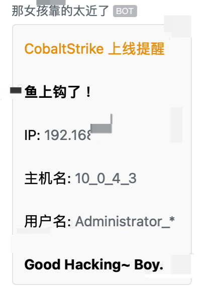
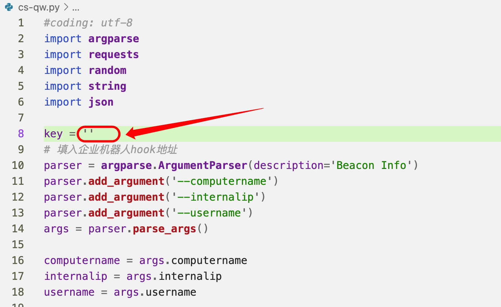
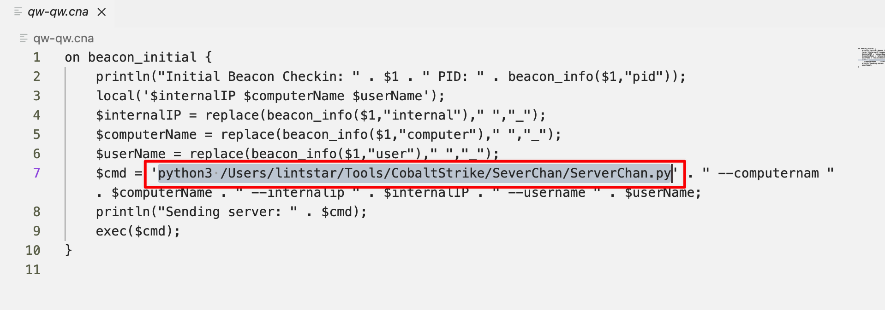

# CS-wecom

**通过 CobaltStike 服务端 / 客户端 挂载脚本，将上线主机信息通过企微机器人推送**

# 前言

- Server酱要收费
- PushPlus感觉图标不好看
- 开源方案的企微消息推送到微信，觉着麻烦，从微信点开消息要点两次。
- .......


反正也就是改了一下脚步而已，原理很简单，调用企业微信机器人的api。方法很多，因人而异。之前很喜欢用**方糖**。

> 如果想使用免费且支持微信模板消息推送的方式可以移步：https://github.com/lintstar/CS-PushPlus
>
> 如果有订阅 ServerChan 的企业微信推送通道可以移步：https://github.com/lintstar/CS-ServerChan
>
> Cobalt Strike的多种上线提醒方法：https://xz.aliyun.com/t/10698

## 可能遇到的困难

必须要两个人**（企业内）**以上的群聊才能创建企微机器人🤖️，所以自己发挥吧。

# 效果




# 用法

1. 把.py文件和.cna文件都丢到cs服务端上

2. 修改.py文件中的key，注意是key，36位的

   

3. 修改.cna文件中**如图的绝对路径**，这个地方修改成py的绝对路径

   

3. cs目录下加载cna脚本

   ```
    ./agscript [host] [port] [user] [pass] </path/to/file.cna>
   ```

   **这里 agscript 的用法为：**

   - **[host] # 服务器的 ip 地址。**
   - **[port] # cs 的端口号，启动 cs 时有显示。**
   - **[user] # 后台挂载脚本时连接到 teamserver 的用户名。**
   - **[pass] # 启动服务端 cs 时设置的密码。**
   - **[path] # cna 文件的路径**
